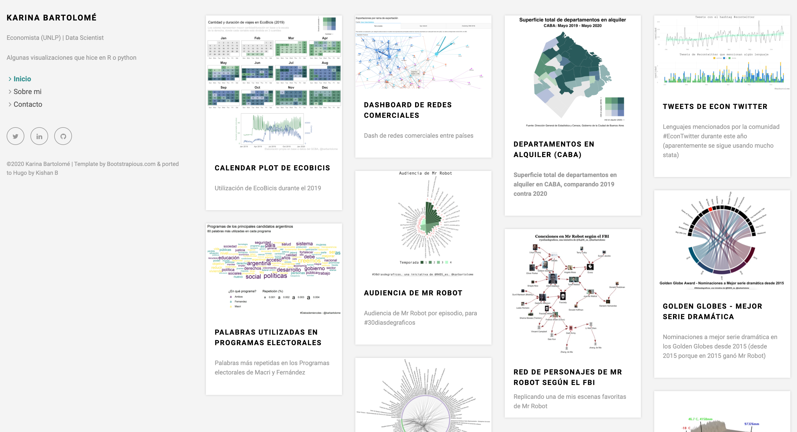
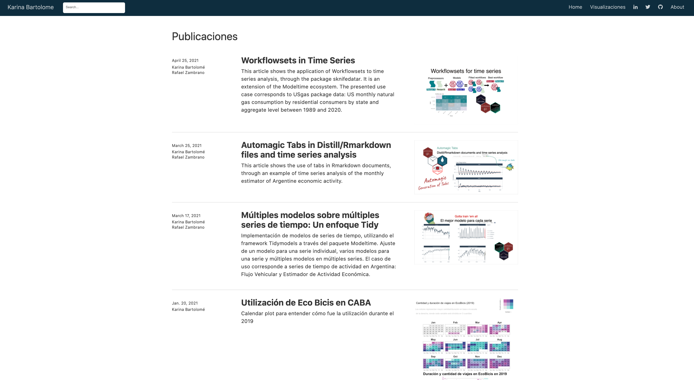
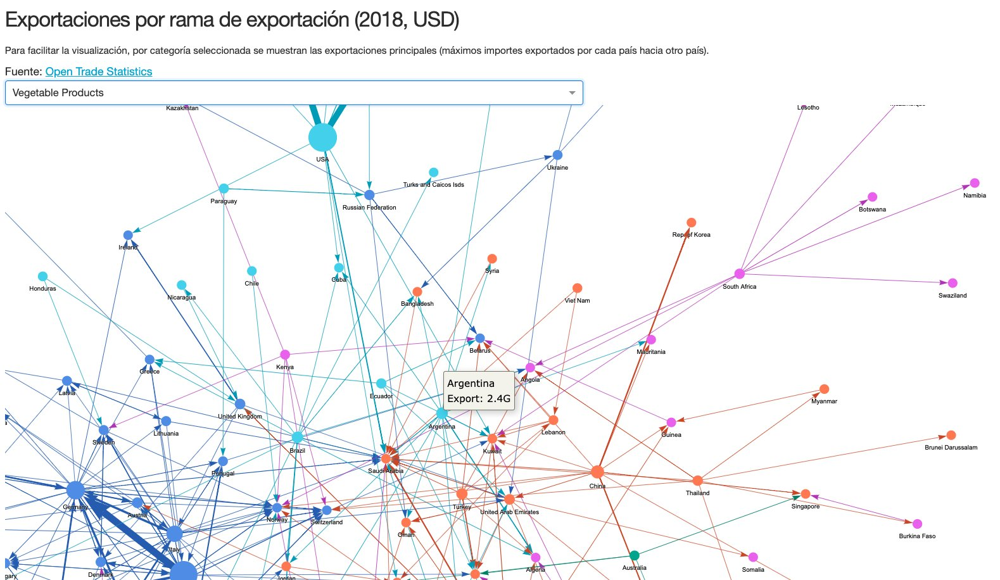

  

:argentina: **Datos de Argentina**

-   [Análisis de superficie total de alquileres en la Ciudad de Buenos Aires](https://github.com/karbartolome/datos_argentina/tree/master/R)
-   [Evolución del valor bruto de producción por rama de actividad: 2004q1 - 2020-q1](https://github.com/karbartolome/datos_argentina/blob/master/R/valor_bruto_produccion.R)
-   [Uso de Eco Bicis durante el 2019](https://github.com/karbartolome/datos_argentina/blob/master/R/ecobicis-calendarplot.R)
-   [Dashboard ENACOM - en curso](https://github.com/karbartolome/enacom)

:seedling: **Participación en iniciativas**

-   [Datos de miércoles](https://github.com/karbartolome/datosdemiercoles)
-   [Tidy Tuesday](https://github.com/karbartolome/tidytuesday)
-   [30 días de gráficos (Mr Robot)](https://github.com/karbartolome/30diasdemrrobot)

:busts_in_silhouette: **Redes sociales**

-   [Hashtag \#econtwitter durante la primera mitad del 2020](https://github.com/karbartolome/twitter)
-   [Visualización de mi red de contactos en Linkedin](https://github.com/karbartolome/linkedin-network)

:school: **Workshops**

-   [Women Techmakers Buenos Aires: Api de transporte GCBA](https://github.com/karbartolome/workshop_api_transporte_mapas)
-   [EANT - Workshop Data Analytics con Python](https://github.com/karbartolome/Workshop-Eant-Data-Analytics-Python)

:memo: **Blogs & Dashboards:**

    
    
    

