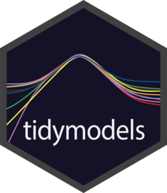
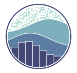
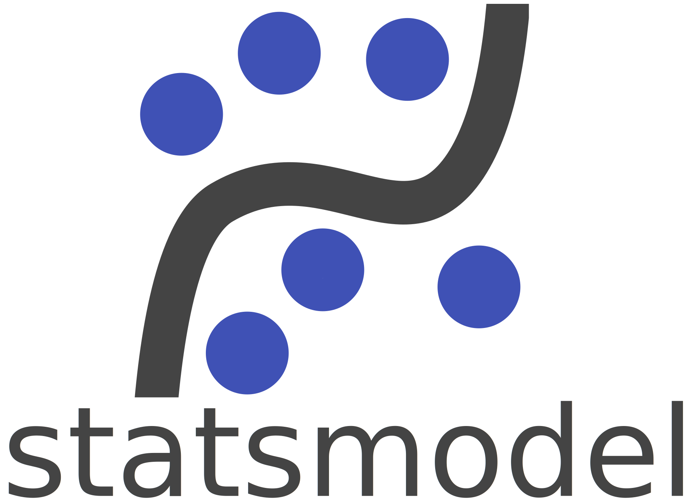

# Hola!

Soy Karina Bartolomé, me desempeño como data scientist en el rubro fintech. Tengo un [blog](ttps://karbartolome-blog.netlify.app/) sobre modelado y visualización de datos. 

  
  
  
  
  
  
  
  
  
  
  
  
  
  

## Participación en iniciativas y workshops

- [Workshops](https://github.com/karbartolome/workshops)
- [R-Ladies](https://github.com/karbartolome/rladies_charlas)
- [Datos de miércoles](https://github.com/karbartolome/datosdemiercoles)
- [TidyTuesday](https://github.com/karbartolome/tidytuesday)
- [30 días de gráficos: Mr. Robot](https://github.com/karbartolome/30diasdemrrobot)
- [Women Techmakers Buenos Aires: API de transporte GCBA](https://github.com/karbartolome/workshop_api_transporte_mapas)
- [EANT: Workshop Data Analytics con Python](https://github.com/karbartolome/Workshop-Eant-Data-Analytics-Python)

## Datos de Argentina 🇦🇷

- [Análisis del uso del subte: comparación de {pandas} de python y {gt} de R para generar tablas](https://karbartolome.quarto.pub/the-grammar-of-tables/)
- [Análisis de superficie total de alquileres en la Ciudad de Buenos Aires](https://github.com/karbartolome/datos_argentina/tree/master/R)
- [Evolución del valor bruto de producción por rama de actividad: 2004 Q1 - 2020 Q1](https://github.com/karbartolome/datos_argentina/blob/master/R/valor_bruto_produccion.R)
- [Uso de EcoBicis durante 2019](https://github.com/karbartolome/datos_argentina/blob/master/R/ecobicis-calendarplot.R)
- [Dashboard ENACOM](https://github.com/karbartolome/enacom)

## Análisis de redes sociales

- [Hashtag #econtwitter durante la primera mitad de 2020 (twint)](https://github.com/karbartolome/twitter)
- [Visualización de mi red de contactos en LinkedIn](https://github.com/karbartolome/linkedin-network)

## Paquetes en los que contribuyo

- [{shinymatic}](https://github.com/karbartolome/shinymatic): Generación automática de componentes shiny según las columnas de un dataframe. 

- [{sknifedatar}](https://github.com/rafzamb/sknifedatar): modelado de múltiles series de tiempo en simultáneo (una extensión de {modeltime})

## Blog y dashboards

## Redes

  
  
  

